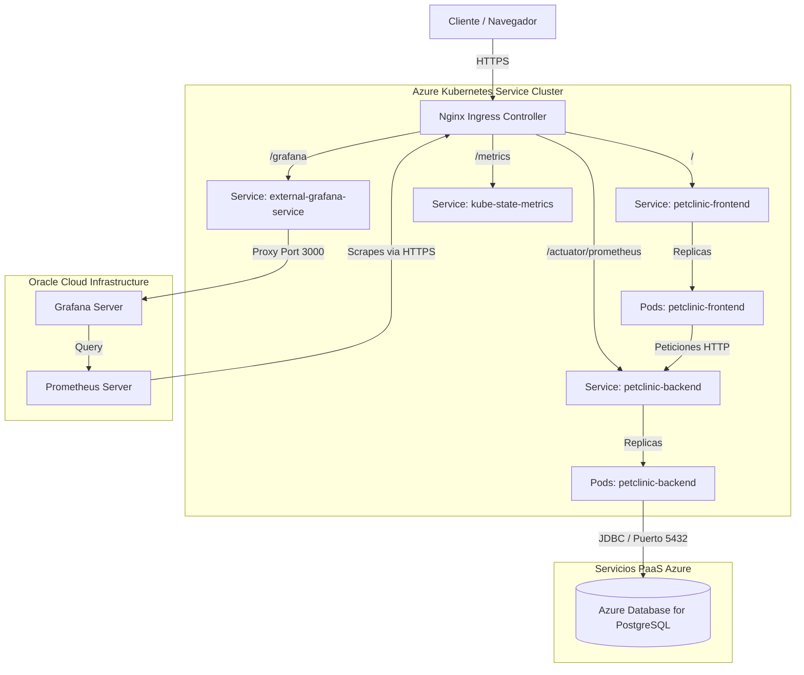

# Spring Petclinic - DevOps Project

Este repositorio contiene la configuración, infraestructura como código (IaC), manifiestos de Kubernetes y código fuente para la implementación de un pipeline DevOps completo para la aplicación **Spring Petclinic**. El despliegue de esta aplicación está diseñado para ejecutarse sobre **Microsoft Azure** y gestionarse con herramientas modernas de CI/CD, observabilidad y automatización.

---

## 🏗️ Arquitectura del Sistema

La arquitectura sigue una topología orientada a microservicios/componentes contenedorizados desplegados sobre un clúster administrado y monitorizados desde un servidor externo para conservar cuotas de computación.

### Diagrama de Arquitectura

### Componentes de la Aplicación

1. **Frontend (Capa de Presentación)**:
   - **Tecnologías**: HTML, CSS, JavaScript corriendo en un servidor web Nginx.
   - **Contenedor**: `ghcr.io/guytho1996/spring-petclinic-devops-frontend`.
   - **Kubernetes**: Despliegue en el clúster (objeto [frontend-deployment.yaml](file:///home/azureuser/spring-petclinic-devops/k8s/frontend-deployment.yaml)) con 2 réplicas. Se expone a través del servicio `petclinic-frontend` en el puerto 80 y está protegido con TLS utilizando un certificado gestionado mediante secretos.

2. **Backend (Capa de Negocio)**:
   - **Tecnologías**: Java 17, Spring Boot, Spring Data JPA, Spring Actuator y Micrometer Prometheus.
   - **Contenedor**: `ghcr.io/guytho1996/spring-petclinic-devops`.
   - **Kubernetes**: Despliegue en el clúster (objeto [deployment.yaml](file:///home/azureuser/spring-petclinic-devops/k8s/deployment.yaml)) con 2 réplicas. Expone la API REST en el puerto 8080. Integra sondas de ciclo de vida (`livenessProbe`, `readinessProbe` y `startupProbe`) apuntando a los endpoints de Actuator.

3. **Base de Datos (Capa de Datos)**:
   - **Motor**: Azure Database for PostgreSQL Flexible Server (versión 15).
   - **Conectividad**: JDBC sobre puerto 5432 con SSL obligatorio (`sslmode=require`).
   - **Entornos**:
     - **Staging**: Utiliza la base de datos `petclinic_dev` en el servidor flexible `petclinic-dev-pg-20260613` (Grupo de recursos: `dev-ops`).
     - **Production**: Utiliza la base de datos `petclinic_prod` en el servidor flexible `petclinic-prod-pg-20260613` (Grupo de recursos: `dev-ops`).

4. **Ingress y Enrutamiento**:
   - **Controlador**: Nginx Ingress Controller.
   - **Ingress Principal** ([ingress.yaml](file:///home/azureuser/spring-petclinic-devops/k8s/ingress.yaml)):
     - `/` -> Apunta al frontend (`petclinic-frontend` puerto 80).
     - `/grafana` -> Redirige las solicitudes al Grafana externo a través de un servicio interno (`external-grafana-service`).
   - **Ingress de Métricas** ([ingress-metrics.yaml](file:///home/azureuser/spring-petclinic-devops/k8s/ingress-metrics.yaml)):
     - `/actuator/prometheus` -> Expone el endpoint de métricas del backend de forma segura al exterior. Cuenta con una anotación de whitelist (`whitelist-source-range`) para restringir el acceso únicamente a la IP del servidor de monitoreo externo (`129.159.70.134`) y a los rangos internos del clúster.

---

## ☁️ Recursos de Infraestructura en Azure (Aprovisionados con Terraform)

Toda la infraestructura está declarada como código en la carpeta [terraform/](file:///home/azureuser/spring-petclinic-devops/terraform/) y aprovisionada en la región `eastus2` (East US 2) de Azure. Los recursos aprovisionados para cada entorno son los siguientes:

| Recurso / Componente | Entorno de Staging | Entorno de Producción |
| --- | --- | --- |
| **Grupo de Recursos** | `petclinic-staging-rg` | `petclinic-production-rg` |
| **Red Virtual (VNet)** | `petclinic-staging-vnet` (Address Space: `10.40.0.0/16`) | `petclinic-production-vnet` (Address Space: `10.42.0.0/16`) |
| **Subnet del Clúster** | `snet-aks` (CIDR: `10.40.1.0/24`) | `snet-aks` (CIDR: `10.42.1.0/24`) |
| **Clúster AKS** | `petclinic-staging-aks` (1 nodo `Standard_B2s`, SKU Free) | `petclinic-production-aks` (2 nodos `Standard_B2s`, SKU Free) |
| **Azure Container Registry** | `acrpetclinicstagingcb7nao` (SKU Basic) | `acrpetclinicproductionhiuh55` (SKU Basic) |
| **Storage Account** | `stpetclinicstagingcb7nao` (para artefactos) | `stpetclinicproductionhiu` (para artefactos) |
| **Log Analytics Workspace** | `petclinic-staging-logs` | `petclinic-production-logs` |
| **IP Pública de Salida (Outbound)** | `52.177.218.11` (`petclinic-staging-aks-outbound-pip`) | `23.102.119.241` (`petclinic-production-aks-outbound-pip`) |

*Nota: La IP pública de salida de cada AKS se configura en las reglas de firewall del servidor flexible de PostgreSQL correspondiente para autorizar de forma segura las conexiones entrantes desde el clúster Kubernetes.*

---

## 📊 Observabilidad y Monitoreo (Servidor Externo)

Para optimizar y no sobrecargar la cuota de CPU/memoria del clúster de Kubernetes en el entorno de desarrollo y staging (el cual corre sobre un nodo limitado de tamaño `Standard_B2s`), se ha desacoplado el stack de monitoreo:

* **Servidor Externo de Observabilidad**: Las herramientas de **Prometheus** y **Grafana** están desplegadas fuera de Azure, en una instancia externa hospedada en **OCI (Oracle Cloud Infrastructure)** con la IP pública **`129.159.70.134`**.
* **Integración del Ingress**: El Ingress del clúster AKS redirige el tráfico HTTPS de `/grafana` al servicio interno `external-grafana-service` (definido en [external-grafana.yaml](file:///home/azureuser/spring-petclinic-devops/k8s/external-grafana.yaml)). Este servicio asocia los endpoints de Kubernetes directamente con la IP pública del servidor de OCI en el puerto `3000`.
* **Redirección Raíz**: Se cuenta con el Ingress [grafana-root-redirect.yaml](file:///home/azureuser/spring-petclinic-devops/k8s/grafana-root-redirect.yaml) para redirigir automáticamente peticiones desde `/grafana/` hacia el panel de SLO/DORA principal.
* **Scraping de Métricas**:
  * El servidor externo de Prometheus realiza scraping del backend a través de la ruta `/actuator/prometheus` (expuesta de manera segura vía Ingress).
  * También recopila métricas de estado de los recursos de Kubernetes mediante `kube-state-metrics` (desplegado localmente en el clúster a través de [kube-state-metrics.yaml](file:///home/azureuser/spring-petclinic-devops/k8s/kube-state-metrics.yaml)).
* **SLOs y Alertas**: El sistema monitoriza objetivos de nivel de servicio (SLOs) de Disponibilidad (99.9% libre de errores HTTP 5xx) y Latencia (P99 < 1s), disparando alertas como:
  * `PetclinicHttp5xxErrorRateHigh` (Tasa de errores 5xx > 1% por 5 min).
  * `PetclinicErrorBudgetBurnFast` (Presupuesto de error consumiéndose a más de 10x).
  * `PetclinicLatencyP99High` (Latencia P99 > 1 segundo por 10 minutos).

---

## ⚙️ Estructura del Repositorio

El monorepo está organizado de la siguiente manera:

* [k8s/](file:///home/azureuser/spring-petclinic-devops/k8s/): Manifiestos de Kubernetes para desplegar la aplicación (ingress, servicios, secretos, endpoints).
* [terraform/](file:///home/azureuser/spring-petclinic-devops/terraform/): Código de infraestructura en Azure (configurado para entornos `staging` y `production`).
* [monitoring/](file:///home/azureuser/spring-petclinic-devops/monitoring/): Configuración de Prometheus, Grafana, cuadros de mando y scripts del exportador de métricas DORA.
* [frontend/](file:///home/azureuser/spring-petclinic-devops/frontend/): Código de la interfaz de usuario web basada en Nginx.
* [src/](file:///home/azureuser/spring-petclinic-devops/src/): Código fuente en Java de la aplicación Spring Boot.
* [docs/](file:///home/azureuser/spring-petclinic-devops/docs/): Documentación técnica del proyecto, incluyendo el [postmortem blameless](file:///home/azureuser/spring-petclinic-devops/docs/blameless-postmortem-inc-2026-06-15-001.md) de incidentes.
* [scripts/](file:///home/azureuser/spring-petclinic-devops/scripts/): Scripts de soporte para la configuración de certificados Let's Encrypt, simulación de tráfico y actualizaciones de Kubernetes.
